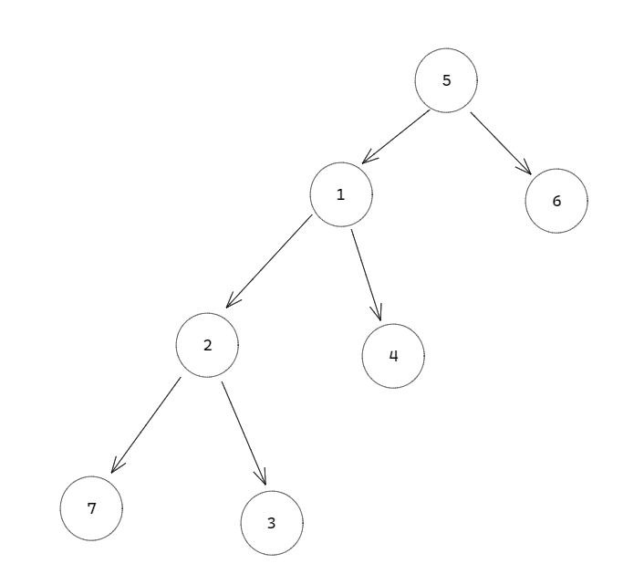

# Smallest Leaf Ancestry Path

Given a tree graph of `n` nodes, where <code>edges[i] = [ai, bi]</code> indicates that there is an edge between nodes <code>ai</code> and <code>bi</code>, return the ancestry path of the smallest leaf node in the graph. A leaf node is a node with no children.

## Input

edges = [[5,1], [5,6], [1,2], [1,4], [2,3], [2,7]]

root_node = 5

## Output
[5,1,2,3]

## Contraints
- 1 < n < 10000
- only 1 root node in the graph
